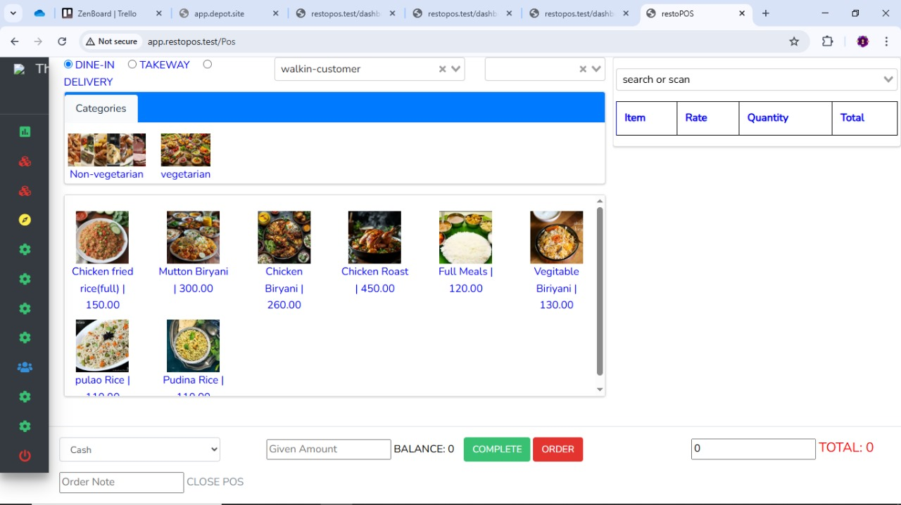
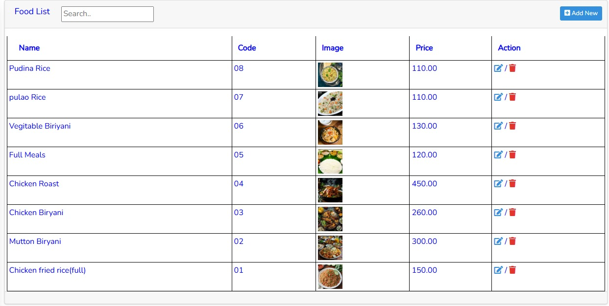

# RestoPOS

RestoPOS is a **SaaS-based multi-tenancy restaurant billing & management system** built with **Laravel** and **Vue.js**. It leverages **AdminLTE** for the UI and **Stancl Tenancy** for multi-tenancy management.




## Features

- Multi-tenancy support using **Stancl Tenancy**
- Restaurant billing & management functionalities
- Built with **Laravel** (backend) and **Vue.js** (frontend)
- Uses **AdminLTE** for a modern and responsive UI
- API authentication via **Laravel Passport**
- **Multiple Print Formats** including thermal print support
- **Kitchen Order Ticket (KOT) Support**
- **Recipe Management** with auto ingredient deduction
- **Expense Management**
- **Profit & Loss Report** and other detailed reports
- **Employee Management**
- **Account Management**
- **Multiple Payment Methods** including split payment support
- **Order Types:** Dine-in, Takeaway, Delivery, Pre-booking
- **Table Management**

## Installation

### 1. Clone the Repository

```sh
git clone https://github.com/faizaldevs/restopos.git
cd restopos
```

### 2. Configure Environment

- Rename `.env.sample` to `.env`:
  
  ```sh
  cp .env.sample .env
  ```
  
- Update database credentials in the `.env` file.

### 3. Install Dependencies

```sh
composer install
npm install
```

### 4. Build Frontend Assets

```sh
npm run dev   # For development
npm run watch # For continuous development
npm run prod  # For production
```

### 5. Run Migrations

```sh
php artisan migrate
```

### 6. Install Passport for API Authentication

```sh
php artisan passport:install
```

### 7. Configure Virtual Host

- Set up a virtual host like `restopos.site` or configure it as needed.
- Add the domain to the `central_domains` setting in the `.env` file.

### 8. Access the Application

- Open the central domain in your browser.
- Login with:
  - **Email**: `admin@admin.com`
  - **Password**: `123456789`

### 9. Create a Tenant

- Once logged in, create a tenant by entering the required details.
- Add the tenant’s domain to your virtual host.
- Access the tenant’s website using the created credentials.

---

## License

This project is open-source and available under the [MIT License](LICENSE).

## Contribution

Feel free to fork the repository, submit issues, or contribute via pull requests!
